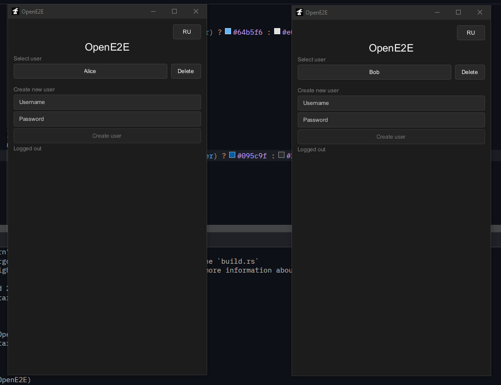
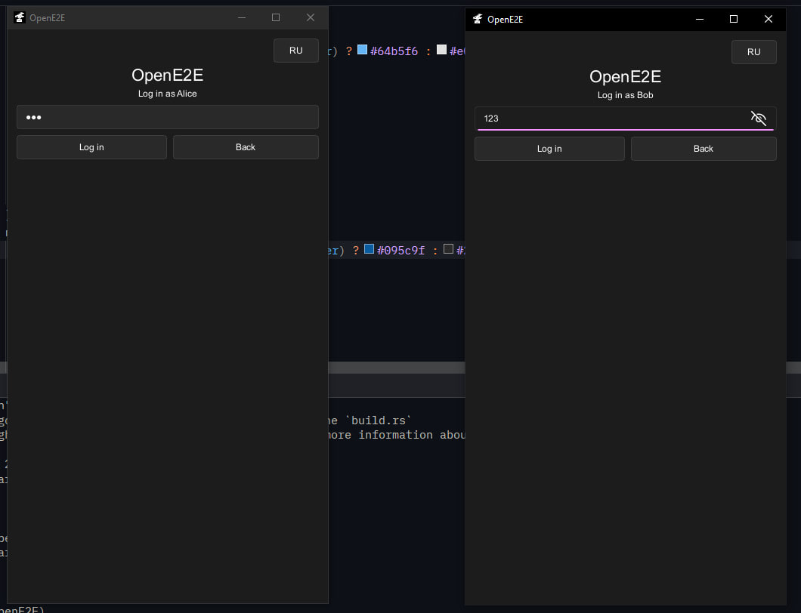
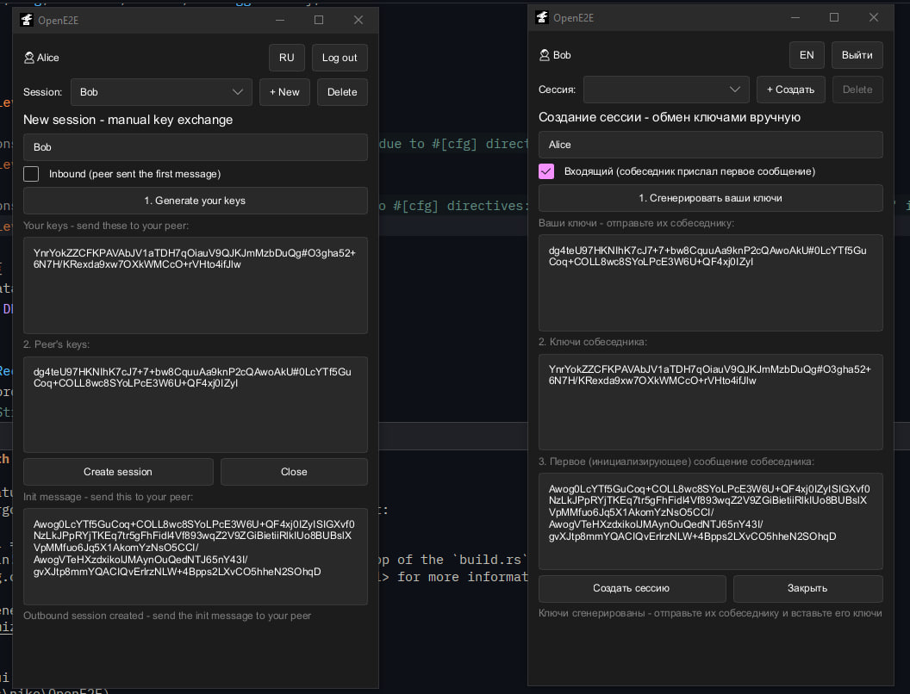
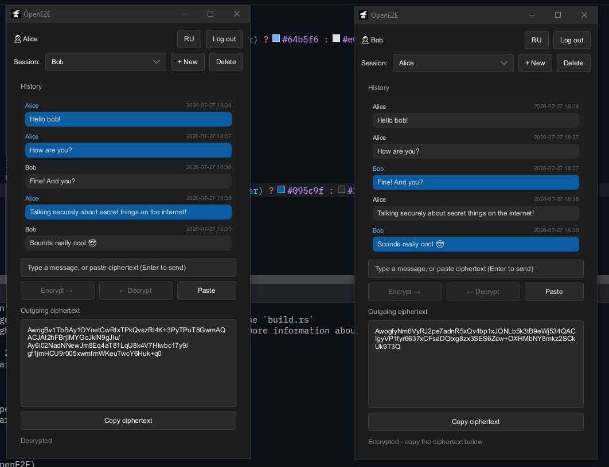

<div align="center">
<h1> OpenE2E </h1>

</div>

> [!WARNING]
>
> Under active development.
> See the [Roadmap](#roadmap).

**Languages:** [English](README.md) | [Русский](doc/README.ru.md)

# Overview

OpenE2E is a manual secure chat app for exchanging encrypted messages over any channel, from SMS and email to messengers, social platforms, or other untrusted channels.

The app handles encryption and decryption locally, while you move encrypted payloads between people using whatever channel is available. This makes it useful anywhere direct secure transport is unavailable or inconvenient.

OpenE2E uses **Matrix OLM** via the `voldozemac` library, with **AES-256-GCM** for message encryption and **end-to-end encryption with Perfect Forward Secrecy (PFS)**.

More information about the encryption model and internal design: [OLM.md](doc/OLM.md)

# What's This For?

**OpenE2E** lets you send messages through *any* channel (text, email, social media, and so on) so that only you and the recipient can read them. You encrypt messages on your device, copy the encrypted text, and paste it anywhere.

## Why Confidentiality Matters

**Data collection and analysis.** Companies and government agencies collect information about your location, contacts, browsing history, and online behavior. This data is used to build profiles, predict preferences, and target you with tailored content or messaging. In some cases, it's also used to identify and track "problematic" populations.

**Automated content analysis.** With advances in machine learning, tools have emerged that can automatically analyze, categorize, and filter vast volumes of communications. Your messages can be scanned for specific content, flagged by algorithms, or reported to authorities. While such systems are still imperfect and produce false positives, they are becoming increasingly accurate and widespread.

**What this means in practice.** Even if you're doing nothing illegal, your private thoughts, plans, and opinions can be misinterpreted by an algorithm, taken out of context, or used against you later, for example, when applying for a job, seeking a loan, or in legal proceedings.

**Why end-to-end encryption matters:** When your messages are encrypted, neither companies nor government systems can scan or analyze them. Your communication remains visible only to you and the recipient - beyond the reach of mass monitoring and algorithmic analysis.

OpenE2E ensures that your private messages are protected from interception, analysis, and censorship by third parties. Your data remains under your control.

# Features

- **Manual Secure Chat** - Exchange encrypted messages by copy-pasting them through any channel
- **End-to-End Encryption** - Messages are encrypted locally and can only be decrypted by the intended recipient
- **Perfect Forward Secrecy** - Past messages stay protected even if later keys are compromised
- **Works Over Any Channel** - SMS, email, messengers, government platforms, and other public channels
- **Local Storage** - All data stays on your device
- **Encrypted Storage** - Messages and sessions are stored locally in an encrypted with AES-256-GCM database
- **Chat-Like Interface** - A clean UI built with **Slint**
- **Rust-Based** - Memory safe and blazingly fast

# How It Works

1. **Create a Session** - Start a new conversation in the app
2. **Exchange Public Keys** - Generate your ephemeral public key and share it with your contact by any channel
3. **Receive Their Key** - Paste your contact's public key into the app to establish the session
4. **Write a Message** - Enter your message in the app
5. **Encrypt and Copy** - The app encrypts the message locally and gives you the ciphertext to send anywhere
6. **Receive Ciphertext** - Paste the encrypted message from your contact into the app
7. **Decrypt Locally** - The app decrypts it on your device and shows it in a readable chat view
8. **Continue the Conversation** - Repeat the same process for ongoing secure communication

# Installation

## Installation from source

### Build from Source

**Requirements:**
- Rust

```bash
git clone https://codeberg.org/bazelik-dev/OpenE2E.git
cd OpenE2E
cargo build --release
./target/release/OpenE2E
```

Add `--features gui` to build command for Slint UI.

## Installation from pre-built binaries

### Installation

- Go to [Releases](https://codeberg.org/bazelik-dev/OpenE2E/releases) and download latest binary (СLI or GUI)

### Verification

- Download `.asc` signature file from releases tab.
- Verify: `gpg --auto-key-locate keyserver --keyserver-options auto-key-retrieve --verify OpenE2E*.asc $(find . -maxdepth 1 -name 'OpenE2E*' ! -name '*.asc')`
- Key should match key published at: https://keys.openpgp.org/vks/v1/by-fingerprint/C4C5BDC6C5E4C96CF12B3E85B7BBEB3BC5439F72


# Security Features

- **Perfect Forward Secrecy (PFS)** - OLM's ratchet-based design limits the impact of key compromise
- **End-to-End Encryption** - Only the two endpoints can read message contents
- **Local Storage Only** - No cloud sync, no server-side message storage
- **Manual Key Exchange** - No automatic trust assumptions
- **Channel Agnostic** - Encrypted data can travel through almost any medium

### Data Protection

Messages and sessions are stored locally in fjall DB, AES-256-GCM encrypts all message data at rest in fjall DB and AES-CBC-HMAC encrypts all sessions and accounts data. Each message uses a randomly generated 12-byte nonce to ensure ciphertext uniqueness.

All encryption keys are derived from your user password and stored in memory during the session. Keys are never written to disk or persisted after logout.

# Limitations

- Requires manual key exchange
- Messages must be copied and pasted between channels
- No multi-device support (DB must be manually shared)
- Not yet ready for production use

# Roadmap

- [x] CLI prototype
- [x] Core encryption and key exchange
- [x] Encrypted message send/receive
- [x] Local session storage
- [x] Message DB storage
- [x] Rus localisation
- [x] CLI chat app, demo release
- [x] GUI chat app with Slint
- [ ] File sending
- [ ] Improved GUI
- [ ] Obfuscation mode
- [ ] Packaging and release builds

# Screenshots

### User Management


### Login


### Session Creation


### Chat


# License

This project is licensed under the **GNU General Public License v3.0**. See the [LICENSE](LICENSE) file for details.

You are free to use, modify, and distribute this software under the terms of the GPL 3.0. For more information, visit https://www.gnu.org/licenses/gpl-3.0.html

# Contributing

Contributions are welcome! Please submit issues and pull requests on [Codeberg](https://codeberg.org/bazelik-dev/OpenE2E).

# Disclaimer and Terms of Use

OpenE2E is provided as a tool for protecting private communication in accordance 
with free and open-source software principles.

## Your Responsibility

Users are fully responsible for:
- Verifying that their use complies with the laws of their jurisdiction
- All legal and ethical consequences of using this tool
- Respecting the rights of others

## Limitations of Our Liability

The developer(s) of OpenE2E:
- Do not bear legal responsibility for the use of this software
- Do not control or monitor its application (the application runs locally on your device)
- Do not provide legal or technical support for unlawful activities
- Explicitly do not endorse use for criminal purposes

## Lawful Use

OpenE2E is designed to protect lawful private communication, including:
- Business correspondence
- Personal privacy
- Journalism and source protection
- Protection against mass surveillance

Before using this tool, ensure that your use complies with the laws of your jurisdiction.


Copyright (C) 2026 bazelik-dev
